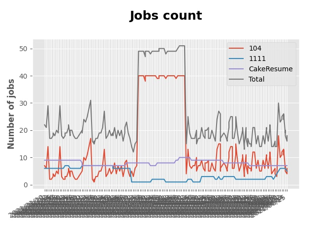

# Auto searching jobs

## Jobs include `flask` in Taiwan 

 


### Platform - 104


|    | company                                                                                | job_title                                                                                               | update_time   |
|---:|:---------------------------------------------------------------------------------------|:--------------------------------------------------------------------------------------------------------|:--------------|
|  1 | [小柿智檢科技股份有限公司](https://www.104.com.tw/company/1a2x6bl77l?jobsource=2018indexpoc)       | [後端工程師 Back-End Engineer](https://www.104.com.tw/job/71bmd?jobsource=2018indexpoc)                      | 7/03          |
|  2 | [小柿智檢科技股份有限公司](https://www.104.com.tw/company/1a2x6bl77l?jobsource=2018indexpoc)       | [全端工程師 Full-Stack Engineer](https://www.104.com.tw/job/71bmz?jobsource=2018indexpoc)                    | 7/03          |
|  3 | [易勝資訊股份有限公司](https://www.104.com.tw/company/1a2x6bj8og?jobsource=jolist_c_relevance)   | [Python後端開發工程師(DevOps整合平台)](https://www.104.com.tw/job/7asvo?jobsource=jolist_c_relevance)              | 7/01          |
|  4 | [桔畝智慧股份有限公司](https://www.104.com.tw/company/1a2x6blm8y?jobsource=2018indexpoc)         | [Back-End Development Engineer後端工程師](https://www.104.com.tw/job/7a80a?jobsource=2018indexpoc)           | 7/02          |
|  5 | [禾新數位有限公司](https://www.104.com.tw/company/1a2x6bjs3i?jobsource=2018indexpoc)           | [[ E-C03 ] Full Stack Engineer（線上面試+因應疫情居家上班）](https://www.104.com.tw/job/76q8f?jobsource=2018indexpoc) | 7/03          |
|  6 | [紅門互動股份有限公司](https://www.104.com.tw/company/oh4m67k?jobsource=jolist_c_relevance)      | [Python Flask網站開發工程師(台北)](https://www.104.com.tw/job/6xtfl?jobsource=jolist_c_relevance)                | 6/28          |
|  7 | [紅門互動股份有限公司](https://www.104.com.tw/company/oh4m67k?jobsource=jolist_c_relevance)      | [Python Flask網站研發工程師(台中)](https://www.104.com.tw/job/6kf9h?jobsource=jolist_c_relevance)                | 6/28          |
|  8 | [萊鎂醫療器材股份有限公司](https://www.104.com.tw/company/bkgh1dc?jobsource=jolist_c_relevance)    | [雲端應用工程師](https://www.104.com.tw/job/791cq?jobsource=jolist_c_relevance)                                | 6/30          |
|  9 | [蓋特資訊系統股份有限公司](https://www.104.com.tw/company/1a2x6biptb?jobsource=jolist_c_relevance) | [Senior Machine Learning Engineer](https://www.104.com.tw/job/6e6r8?jobsource=jolist_c_relevance)       | 6/04          |

### Platform - 1111


|    | company                                              | job_title                                          | update_time   |
|---:|:-----------------------------------------------------|:---------------------------------------------------|:--------------|
|  1 | [億力資訊股份有限公司](https://www.1111.com.tw/corp/54937860/) | [python工程師](https://www.1111.com.tw/job/97374762/) | 2021-07-02    |
|  2 | [長青資訊股份有限公司](https://www.1111.com.tw/corp/71694811/) | [後端工程師](https://www.1111.com.tw/job/85012186/)     | 2021-07-01    |

### Platform - CakeResume


|    | company                                                                               | job_title                                                                                                                           | update_time          |
|---:|:--------------------------------------------------------------------------------------|:------------------------------------------------------------------------------------------------------------------------------------|:---------------------|
|  1 | [Cathay Financial Holdings 國泰金控](https://www.cakeresume.com/companies/cathayholdings) | [軟體開發工程師 Python Software Engineer(數數發中心, DDT)](https://www.cakeresume.com/companies/cathayholdings/jobs/f5c69a)                     | Updated 3 Months ago |
|  2 | [Proto 新語科技有限公司](https://www.cakeresume.com/companies/proto-cx)                       | [Backend Developer (Python)](https://www.cakeresume.com/companies/proto-cx/jobs/backend-developer-python)                           | Updated 3 Months ago |
|  3 | [玉山商業銀行股份有限公司](https://www.cakeresume.com/companies/esunbank)                         | [後端工程師 Back-end Enginee](https://www.cakeresume.com/companies/esunbank/jobs/back-end-enginee)                                       | Updated 3 months ago |
|  4 | [瞬聯科技股份有限公司](https://www.cakeresume.com/companies/cienet)                             | [Cloud Service 軟體工程師](https://www.cakeresume.com/companies/cienet/jobs/cloud-service-software-engineer)                             | Updated 3 Months ago |
|  5 | [紅門互動股份有限公司](https://www.cakeresume.com/companies/eagleeye-5332f1)                    | [Python Flask網站開發工程師(台北)](https://www.cakeresume.com/companies/eagleeye-5332f1/jobs/python-flask-web-development-engineer-taipei)   | Updated 3 Months ago |
|  6 | [紅門互動股份有限公司](https://www.cakeresume.com/companies/eagleeye-5332f1)                    | [Python Flask網站研發工程師(台中)](https://www.cakeresume.com/companies/eagleeye-5332f1/jobs/python-flask-website-r-amp-d-engineer-taichung) | Updated 3 Months ago |
|  7 | [菜蟲農食股份有限公司](https://www.cakeresume.com/companies/tsaitung)                           | [Backend Developer (Junior & Senior)](https://www.cakeresume.com/companies/tsaitung/jobs/backend-developer-junior-senior)           | Updated a month ago  |


# Getting started
## Setup Development Environment
▍Method 1 - Python Built-in venv

- Create your virtual environment
```
$ python3 -m venv venv
```
- And enable virtual environment
```
$ . venv/bin/activate
```
- Install requirements
```
$ pip install -r requirements.txt 
```

▍Method 2 - Poetry
- Install requirements
```
$ poetry install
```
- And enable virtual environment
```
$ poetry shell
```

## Setup Keyword & Run

Setup Your Keyword in [main.py](./main.py#L88)
```
if __name__ == "__main__":
    keyword = "flask"
    crawler = JobCrawler(keyword)
    crawler.run()
```

Run Crawler
```
$ python3 main.py
```

# Contributors
PRs are welcome!

This project exists thanks to all the people who contribute.

<a href="https://github.com/hsuanchi/auto-search-flask-job/graphs/contributors">
  
</a>
