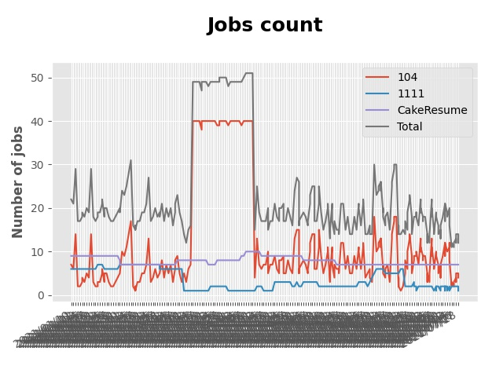

# Auto searching jobs

## Jobs include `flask` in Taiwan 

 


### Platform - 104


|    | company                                                                                       | job_title                                                                                               | update_time   |
|---:|:----------------------------------------------------------------------------------------------|:--------------------------------------------------------------------------------------------------------|:--------------|
|  1 | [大數據股份有限公司](https://www.104.com.tw/company/1a2x6bjjhc?jobsource=2018indexpoc)                 | [分析研發工程師: AI, Deep Learning, Machine Learning](https://www.104.com.tw/job/54ffa?jobsource=2018indexpoc) | 7/15          |
|  2 | [新加坡商齊舵管理顧問有限公司台灣分公司](https://www.104.com.tw/company/1a2x6bldr7?jobsource=jolist_a_relevance) | [影像處理軟體工程師](https://www.104.com.tw/job/77vw9?jobsource=jolist_a_relevance)                              | 4/30          |
|  3 | [麟數據科技股份有限公司](https://www.104.com.tw/company/1a2x6bjpwh?jobsource=2018indexpoc)               | [Python程式設計師](https://www.104.com.tw/job/6uj6n?jobsource=2018indexpoc)                                  | 7/15          |

### Platform - 1111


|    | company                                              | job_title                                          | update_time   |
|---:|:-----------------------------------------------------|:---------------------------------------------------|:--------------|
|  1 | [億力資訊股份有限公司](https://www.1111.com.tw/corp/54937860/) | [python工程師](https://www.1111.com.tw/job/97374762/) | 2021-07-13    |
|  2 | [長青資訊股份有限公司](https://www.1111.com.tw/corp/71694811/) | [後端工程師](https://www.1111.com.tw/job/85012186/)     | 2021-07-11    |

### Platform - CakeResume


|    | company                                                                               | job_title                                                                                                                           | update_time          |
|---:|:--------------------------------------------------------------------------------------|:------------------------------------------------------------------------------------------------------------------------------------|:---------------------|
|  1 | [Cathay Financial Holdings 國泰金控](https://www.cakeresume.com/companies/cathayholdings) | [軟體開發工程師 Python Software Engineer(數數發中心, DDT)](https://www.cakeresume.com/companies/cathayholdings/jobs/f5c69a)                     | Updated 3 Months ago |
|  2 | [Proto Research Inc](https://www.cakeresume.com/companies/proto-cx)                   | [Backend Developer (Python)](https://www.cakeresume.com/companies/proto-cx/jobs/backend-developer-python)                           | Updated 11 days ago  |
|  3 | [玉山商業銀行股份有限公司](https://www.cakeresume.com/companies/esunbank)                         | [後端工程師 Back-end Enginee](https://www.cakeresume.com/companies/esunbank/jobs/back-end-enginee)                                       | Updated 3 Months ago |
|  4 | [瞬聯科技股份有限公司](https://www.cakeresume.com/companies/cienet)                             | [Cloud Service 軟體工程師](https://www.cakeresume.com/companies/cienet/jobs/cloud-service-software-engineer)                             | Updated 3 Months ago |
|  5 | [紅門互動股份有限公司](https://www.cakeresume.com/companies/eagleeye-5332f1)                    | [Python Flask網站開發工程師(台北)](https://www.cakeresume.com/companies/eagleeye-5332f1/jobs/python-flask-web-development-engineer-taipei)   | Updated 3 Months ago |
|  6 | [紅門互動股份有限公司](https://www.cakeresume.com/companies/eagleeye-5332f1)                    | [Python Flask網站研發工程師(台中)](https://www.cakeresume.com/companies/eagleeye-5332f1/jobs/python-flask-website-r-amp-d-engineer-taichung) | Updated 3 Months ago |
|  7 | [菜蟲農食股份有限公司](https://www.cakeresume.com/companies/tsaitung)                           | [Backend Developer (Junior & Senior)](https://www.cakeresume.com/companies/tsaitung/jobs/backend-developer-junior-senior)           | Updated 8 days ago   |


# Getting started
## Setup Development Environment
▍Method 1 - Python Built-in venv

- Create your virtual environment
```
$ python3 -m venv venv
```
- And enable virtual environment
```
$ . venv/bin/activate
```
- Install requirements
```
$ pip install -r requirements.txt 
```

▍Method 2 - Poetry
- Install requirements
```
$ poetry install
```
- And enable virtual environment
```
$ poetry shell
```

## Setup Keyword & Run

Setup Your Keyword in [main.py](./main.py#L88)
```
if __name__ == "__main__":
    keyword = "flask"
    crawler = JobCrawler(keyword)
    crawler.run()
```

Run Crawler
```
$ python3 main.py
```

# Contributors
PRs are welcome!

This project exists thanks to all the people who contribute.

<a href="https://github.com/hsuanchi/auto-search-flask-job/graphs/contributors">
  
</a>
